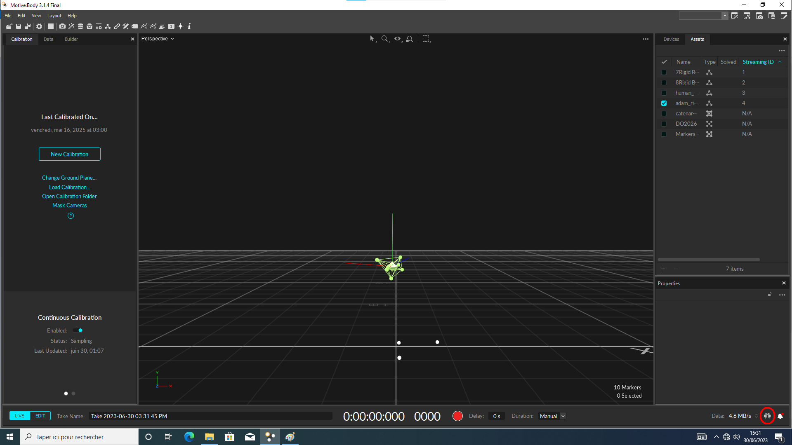
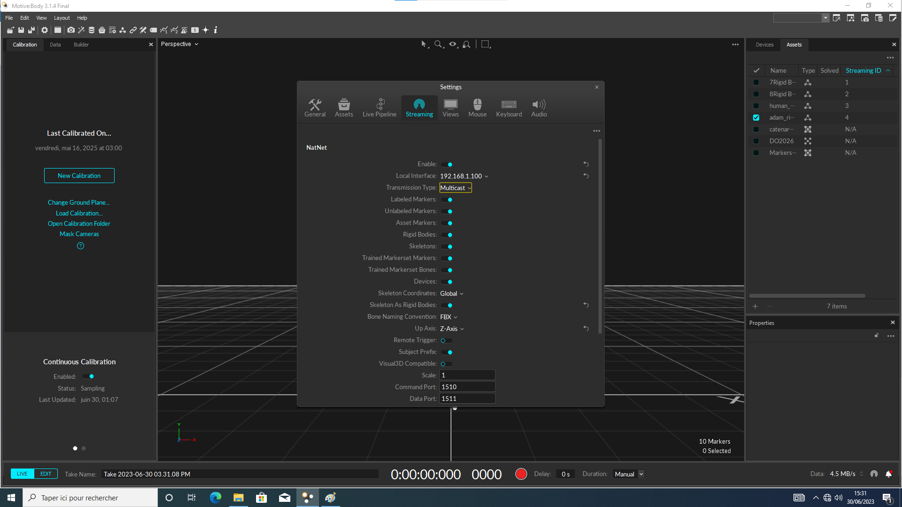
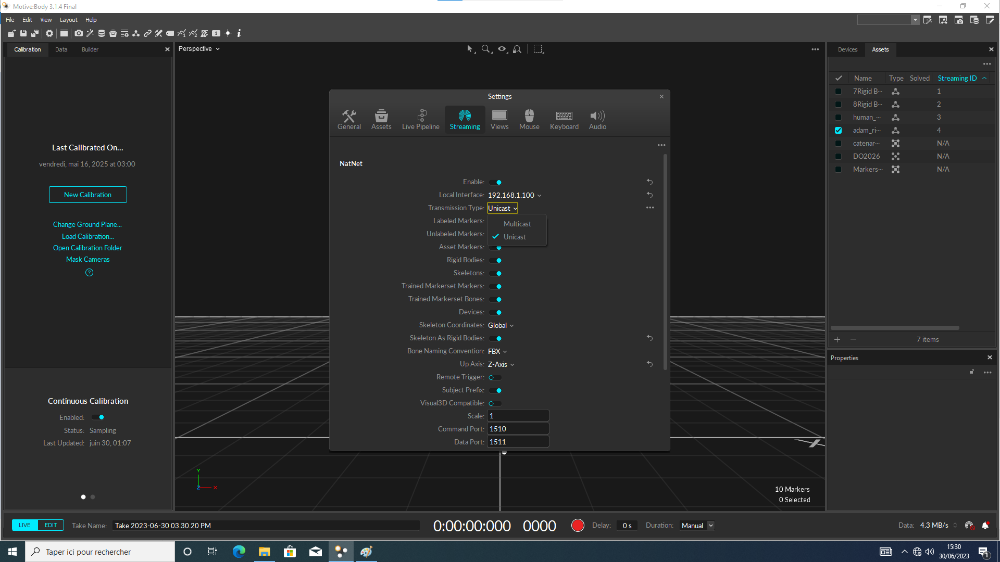
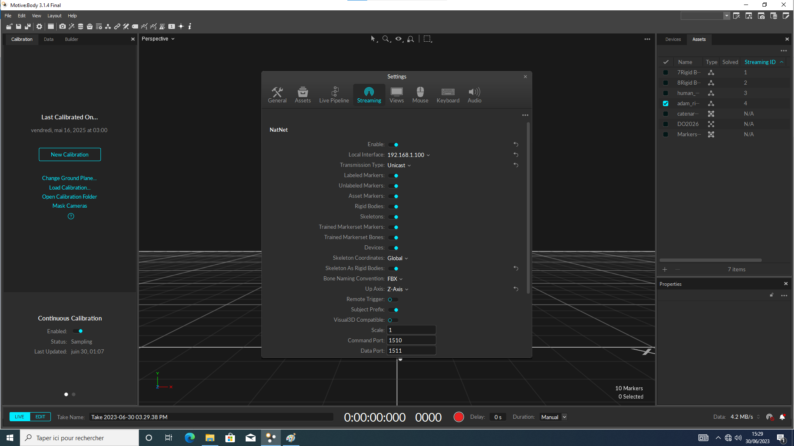
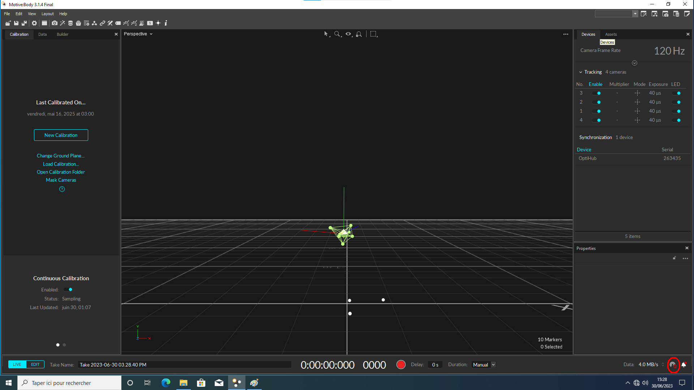

# optitrack_perception_lcfc

Pipeline ROS 2 (Jazzy) de calibration main-œil (*hand-eye*, AX=XB) entre le système
de capture de mouvement OptiTrack/Motive et la plateforme robotique à deux bras UR10e
(robot **gauche** et robot **droite**). Le pipeline permet de calibrer chaque robot
indépendamment, puis en déduit automatiquement la position du robot droit par
rapport au robot gauche.

## Sommaire

- [Architecture](#architecture)
- [Conventions mathématiques](#conventions-mathématiques)
- [Prérequis](#prérequis)
- [Configuration Motive (important)](#configuration-motive-important)
- [Installation](#installation)
- [Utilisation](#utilisation)
- [Structure des sorties](#structure-des-sorties)
- [Dépannage](#dépannage)
- [Roadmap](#roadmap)

## Architecture

Le package ROS 2 `natnet_ros2` contient quatre composants, orchestrés par un seul
launch file :

| Fichier | Rôle |
|---|---|
| `calib_natnet.cpp` | Nœud `rclcpp` : se connecte à Motive via le SDK NatNet, cible un Rigid Body (ID passé en argument ou sélection interactive), publie sa pose sur `/rigid_in_camera` (`geometry_msgs/PoseStamped`) à 120 Hz. |
| `calib_data_collector.py` | Nœud `rclpy` interactif : pour un `robot_side` donné (`left`/`right`), collecte 15 poses appairées (TF robot `{side}_base -> {side}_tool0` + pose OptiTrack), les répartit en 10 (calibration) / 5 (validation), et les sauvegarde. |
| `calib_solver.py` | Script Python : résout AX=XB (solveur Andreff + raffinement Levenberg-Marquardt), valide sur le jeu de validation, et calcule la position relative des deux robots si les deux calibrations existent. |
| `calibration_pipeline.py` | Launch file ROS 2 : enchaîne automatiquement les trois étapes ci-dessus. |

### Séquencement du launch file

Le launch file enchaîne automatiquement les étapes suivantes :

1. Démarrage de `calib_natnet` (connexion à Motive/NatNet).
2. Attente de 2 secondes (`TimerAction`), puis ouverture d'un terminal interactif pour `calib_data_collector.py`, qui collecte les 15 poses.
3. À la fin de la collecte (`OnProcessExit`), arrêt de `calib_natnet` (`pkill`) et lancement de `calib_solver.py` (résolution Andreff + raffinement Levenberg-Marquardt).
4. `calib_solver.py` écrit les résultats dans `results/` et, si les deux robots sont calibrés (qu'il existe les données de calibrations des deux robots), calcule et sauvegarde `right_wrt_left.csv`.
5. À la fin de `calib_solver.py`, fermeture du launche file.

## Conventions mathématiques

| Notation | Signification |
|---|---|
| `bTf` | Base robot → Flange (cinématique directe du robot) |
| `cTr` | Caméra (repère global OptiTrack) → Rigid Body (mesure Motive) |
| `X` / `fTr` | Flange → Rigid Body (offset fixe du marqueur, calculé par AX=XB) |
| `Y` / `cTb` | Caméra → Base robot (calibration extrinsèque du robot dans le repère OptiTrack) |

Toutes les matrices 4×4 sont stockées empilées verticalement dans des fichiers
CSV/texte (séparateur espace), 4 lignes par pose.

## Prérequis

- ROS 2 **Jazzy**
- Motive **3.1.4** (ou ultérieur) + SDK NatNet
- Python 3.12, `numpy`, `scipy`
- Dépendances ROS : `rclcpp`, `rclpy`, `geometry_msgs`, `tf2_ros`

## Configuration Motive (important)

## Mode de streaming NatNet (Unicast)

`calib_natnet.cpp` se connecte à Motive en configurant explicitement
`ConnectionType_Unicast`. Motive doit donc impérativement diffuser en **Unicast**, et
non en Multicast, sous peine de ne recevoir aucune donnée côté client (voir les captures d'écrans ci-dessous).

Deux points à vérifier :

- l'IP du serveur Motive, transmise à `calib_natnet` via l'argument de
  lancement `server_ip`,
- l'IP locale de la machine ROS 2, actuellement codée en dur dans
  `calib_natnet.cpp` (constante `LOCAL_IP`), à adapter sur chaque nouvelle
  machine.







## Installation

```bash
git remote add origin https://gitlab.univ-lorraine.fr/labos/lcfc/robotic-manipulation/optitrack_perception_lcfc.git
git branch -M main
git push -uf origin main
```

Dans un workspace ROS 2 :

```bash
cd ~/ros2_ws/src
git clone https://gitlab.univ-lorraine.fr/labos/lcfc/robotic-manipulation/optitrack_perception_lcfc.git natnet_ros2
cd ~/ros2_ws
colcon build --packages-select natnet_ros2
source install/setup.bash
```

## Utilisation

Lancer la calibration complète pour un robot :

```bash
ros2 launch natnet_ros2 calibration_pipeline.py \
    server_ip:=192.168.1.100 \
    rb_id:=4 \
    robot_side:=left
```

Arguments disponibles :

| Argument | Défaut | Description |
|---|---|---|
| `server_ip` | `192.168.1.100` | IP du serveur Motive |
| `rb_id` | `1` | ID du Rigid Body OptiTrack à suivre |
| `robot_side` | `left` | `left` ou `right` — détermine les TF ciblées et le nom du dossier de sortie |

Le launch file :
1. démarre `calib_natnet`,
2. ouvre un terminal interactif pour collecter 15 poses (`calib_data_collector.py`),
3. arrête `calib_natnet` et lance automatiquement `calib_solver.py` une fois les 15 poses prises,
4. se ferme une fois la calibration terminée.

Répéter l'opération avec `robot_side:=right` pour le second robot. Le calcul
de position relative se déclenche automatiquement dès que les deux
calibrations sont présentes.

`calib_solver.py` peut aussi être relancé manuellement (par exemple pour
retraiter un jeu de données existant) :

```bash
python3 calib_solver.py --robot-side left --date 2026_07_08
```

## Structure des sorties

Tous les dossiers de résultats sont créés à la **racine du workspace** ROS 2
(à côté de `src/`, `build/`, `install/`, `log/`) :

```
ros2_ws/
├── left_dataset_2026_07_08/
│   ├── calibration/        # 10 poses : bTf_matrices.csv, cTr_matrices.csv, ...
│   ├── validation/         # 5 poses
│   └── results/
│       ├── X_fTr.csv                 # flange -> rigid body
│       ├── Y_cTb.csv                 # caméra -> base robot
│       ├── calibration_residuals.csv
│       └── validation_errors.csv
├── right_dataset_2026_07_08/
│   └── ...                           # même structure
├── right_wrt_left.csv                # pose du robot droit dans le repère du robot gauche
└── src/ build/ install/ log/
```

## Dépannage

- **Les axes Y/Z semblent inversés entre Motive et les données reçues** : voir
  [Configuration Motive](#configuration-motive-important). Ce n'est pas un bug
  du pipeline — Motive reste toujours Y-up en interne, seul le flux streamé
  est reconfigurable via `Up Axis`.
- **`Erreur OptiTrack : objet hors champ ou noeud C++ inactif`** pendant la
  collecte : vérifier que `calib_natnet` est bien connecté à Motive, que le
  Rigid Body reste dans le champ des caméras et que le driver **dual_ur_bringup** est bien lancé.
- **`Y_cTb introuvable pour le robot gauche/droit`** lors du calcul de
  position relative : le solveur n'a pas encore été exécuté pour ce robot, ou
  la `--date` fournie ne correspond à aucun dossier existant.
